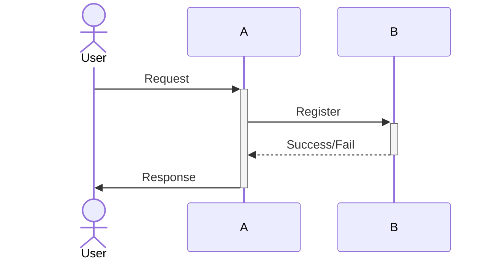
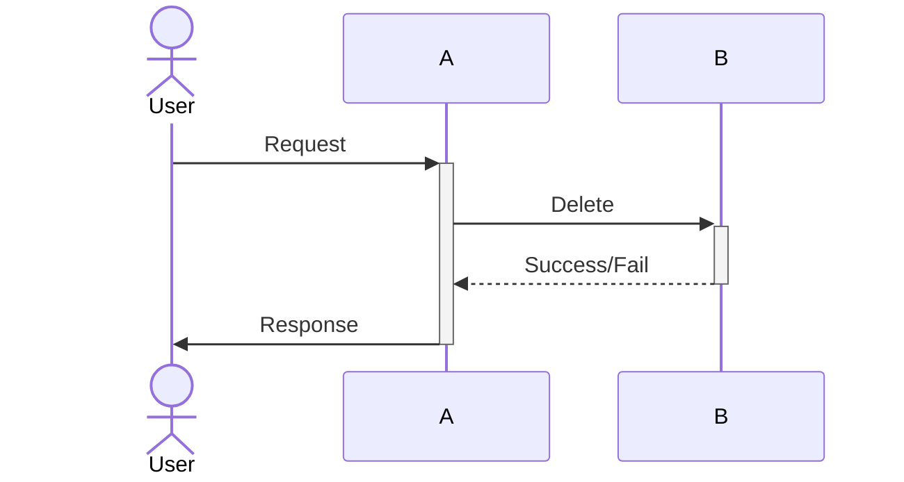

# シーケンス図

Mermaidでシーケンス図を記載する。

## 登録

```mermaid
sequenceDiagram

actor User

User ->>+ A : Request
A ->>+ B : Register
B -->>- A : Success/Fail
A ->>- User : Response

```

## 削除

```mermaid
sequenceDiagram
actor User

User ->>+ A : Request
A ->>+ B : Delete
B -->>- A : Success/Fail
A ->>- User : Response

```